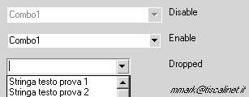



## flatCombobox

### Description

Easy code for clone flat comboBox style office2K
 
### More Info
 

             |
---                |---
**Submitted On**   |2001-08-13 14:42:20
**By**             |[Mark](https://github.com/Planet-Source-Code/PSCIndex/blob/master/ByAuthor/mark.md)
**Level**          |Advanced
**User Rating**    |4.7 (14 globes from 3 users)
**Compatibility**  |VB 3\.0, VB 4\.0 \(16\-bit\), VB 4\.0 \(32\-bit\), VB 5\.0, VB 6\.0
**Category**       |[Custom Controls/ Forms/  Menus](https://github.com/Planet-Source-Code/PSCIndex/blob/master/ByCategory/custom-controls-forms-menus__1-4.md)
**World**          |[Visual Basic](https://github.com/Planet-Source-Code/PSCIndex/blob/master/ByWorld/visual-basic.md)
**Archive File**   |[flatCombob245678132001\.zip](https://github.com/Planet-Source-Code/mark-flatcombobox__1-26145/archive/master.zip)

